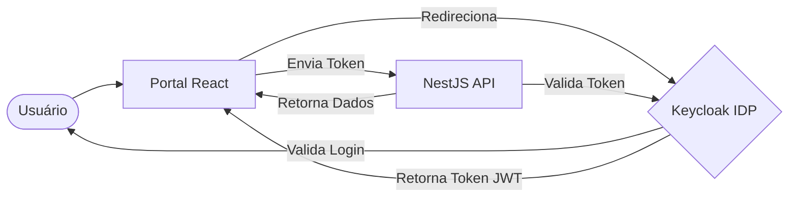

# 🔐 Keycloak: Gestão de Identidade e Acesso (IAM)

Este documento explica o papel do **Keycloak** na nossa plataforma privada RustDesk, os motivos da sua implementação e as vantagens que ele oferece.

---

## 🧐 O que é o Keycloak?

O **Keycloak** é uma solução de gerenciamento de identidade e acesso (Identity and Access Management - IAM) de código aberto. Ele funciona como um "serviço de segurança centralizado" que lida com a autenticação e autorização de usuários para todas as partes do nosso sistema (Frontend, API e futuramente o próprio servidor RustDesk).

Ele implementa protocolos modernos da indústria como **OpenID Connect (OIDC)**, **OAuth 2.0** e **SAML 2.0**.

---

## 🏗️ Por que ele foi implementado neste projeto?

Em um ambiente corporativo ou de suporte crítico, a segurança não pode ser um adendo; ela deve ser o alicerce. O Keycloak foi escolhido para resolver três desafios principais:

1.  **Centralização de Credenciais**: Evita que cada parte do sistema (API, Banco de Dados, Frontend) tenha que gerenciar senhas e usuários de forma isolada.
2.  **Segurança de Nível Bancário**: Implementar fluxos de login seguros e recuperação de senha do zero é propenso a falhas. O Keycloak oferece uma solução robusta e testada por milhares de empresas.
3.  **Padronização**: Ao usar OIDC, podemos integrar outros sistemas ou provedores de identidade (como Google, Microsoft AD ou LDAP) no futuro sem mudar uma linha de código no nosso sistema.

---

## 🚀 Principais Vantagens

### 1. Single Sign-On (SSO)
O usuário faz login uma única vez e ganha acesso a todos os portais (Técnico e Administrativo) sem precisar digitar a senha novamente.

### 2. Autenticação de Múltiplos Fatores (MFA/2FA)
O Keycloak permite ativar facilmente o uso de aplicativos de autenticação (como Google Authenticator ou Authy), garantindo que, mesmo se uma senha for vazada, o sistema continue seguro.

### 3. Gestão Baseada em Papéis (RBAC)
Podemos definir permissões granulares. Por exemplo:
-   **Técnicos**: Podem apenas ver e conectar em máquinas.
-   **Administradores**: Podem gerenciar grupos, ver relatórios e criar novos usuários.

### 4. Segurança de Sessão
O Keycloak gerencia tokens de acesso (JWT) que expiram automaticamente, garantindo que o acesso não permaneça aberto indefinidamente caso um técnico esqueça de deslogar.

### 5. Interface Customizável e Localizada
Como implementamos recentemente, a interface de login pode ser totalmente traduzida e adaptada à identidade visual da empresa, oferecendo uma experiência profissional ao usuário final.

---

## 🛠️ Como ele se comunica com o projeto?

Ao clicar em "Logar", o Frontend não pede sua senha. Ele te envia para o Keycloak. Após o login, o Keycloak devolve um "crachá digital" (Token) que o Frontend usa para provar para a API quem você é.
